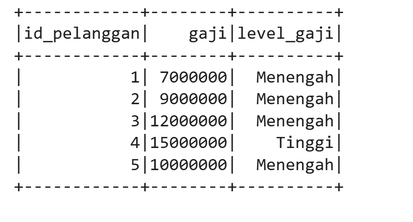
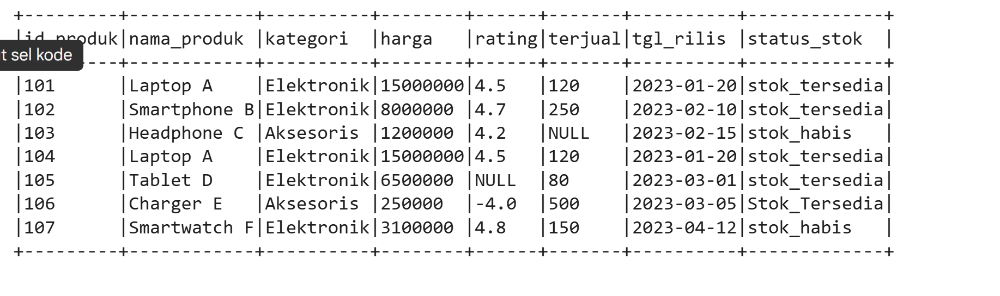
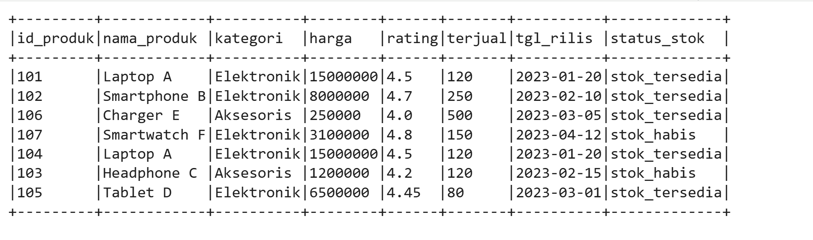
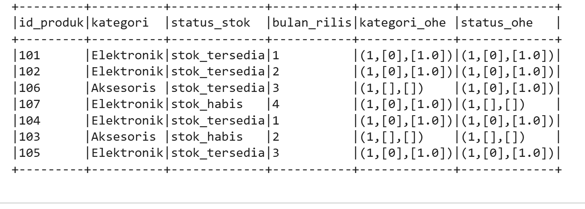

# BigData

# Membuat Dataset Utama

# Agregasi Lanjutan

# Diskretisasi

# Feature Engineering Sederhana

# Buat Dataset Produk

# Data Cleaning

# Standarisasi Data Numerik

# Feature Engineering

# Hasil Akhir

